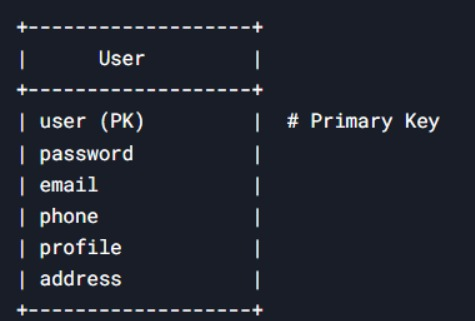
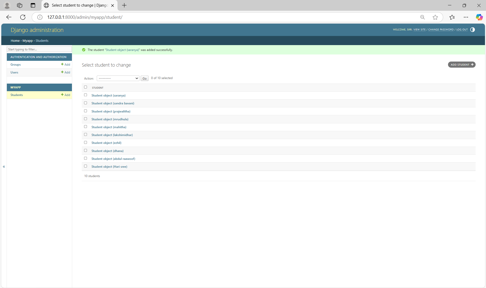

# Ex02 Django ORM Web Application
## Date: 25/04/2025

## AIM
To develop a Django application to store and retrieve data from Movies Database using Object Relational Mapping(ORM).

## ENTITY RELATIONSHIP DIAGRAM



## DESIGN STEPS

### STEP 1:
Clone the problem from GitHub

### STEP 2:
Create a new app in Django project

### STEP 3:
Enter the code for admin.py and models.py

### STEP 4:
Execute Django admin and create details for 10 books

## PROGRAM
### admin.py
``` python
from django.contrib import admin
from myapp.models import Student
admin.site.register(Student)
```
### models.py
``` python
from django.db import models
class Student(models.Model):
    user=models.CharField(max_length=100,primary_key=True)
    password=models.CharField(max_length=100)
    email=models.EmailField()
    phone=models.CharField(max_length=100)
    profile=models.ImageField(upload_to='profile/')
    address=models.TextField()
```


## OUTPUT




## RESULT
Thus the program for creating a database using ORM hass been executed successfully
